

<h1 align="center">Tablica Znakowa - Kontroler</h1>

Tablica Znakowa - Kontroler to alternatywe oprogramowanie obsługujące tablice LED firmy MKEiA.

  
  
  

## Przegląd

Tablica Znakowa - Kontroler to nieskomplikowany, lekki i otwartoźródłowy menadżer zarządzający bazą pieśni kościelnych i obsługującą wyświetlanie ich na tablicach znakowych LED produkowanych dawniej przez firmę MKEiA.

- Współpraca z oryginalnymi tablicami LED firmy MKEiA!
- Wbudowane czcionki używane na prawdziwym sprzęcie!
- Możliwość kategoryzacji pieśni, a także układanie ich w zestawy!
- Możliwość ukrywania poszczególnych slajdów w zależności od zestawu!
- Obsługa najpopularniejszych platform konsumenckich: Windows oraz Android!

Aplikację najlepiej się obsługuje za pomocą komputera, bądź tabletu.

**Uwaga!** Tablica Znakowa - Kontroler to jedynie sterownik! Nie posiada funkcji projekcji pieśni.
Do pełnego działania wymagana jest oryginalna tablica LED od firmy MKEiA (z obsługą uproszczonego protokołu MKEiA), bądź emulator [*Tablica Znakowa*](http://192.168.40.2:3000/ZupaNET-publiczne/vmkeia) od ŻupaNET Development.

  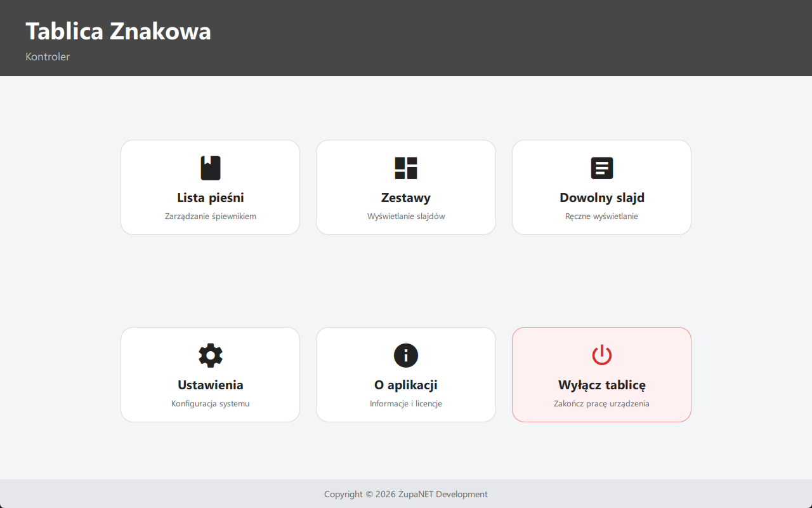
  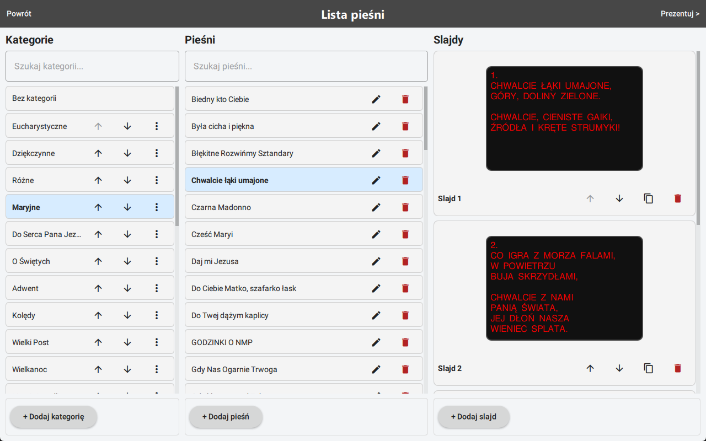
  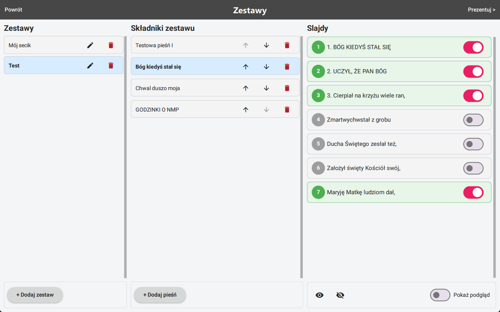
  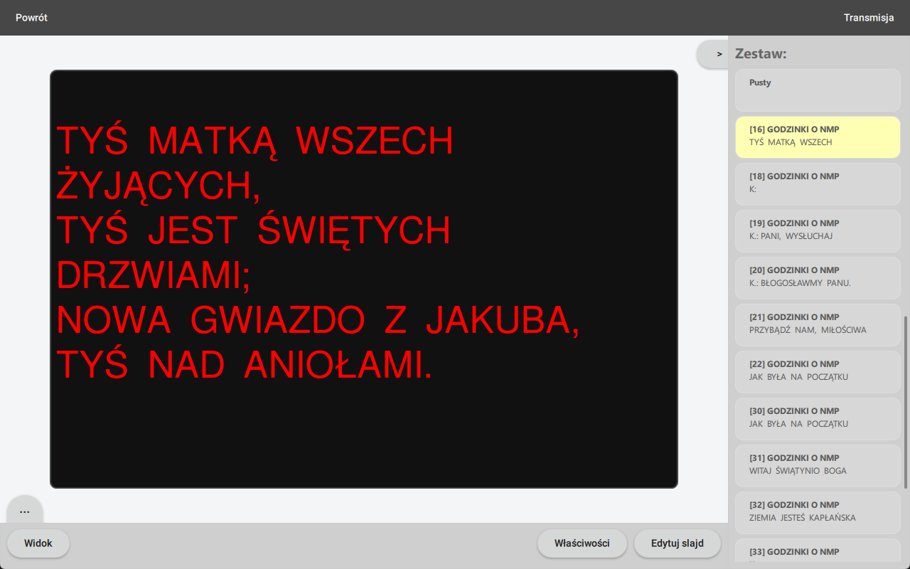
  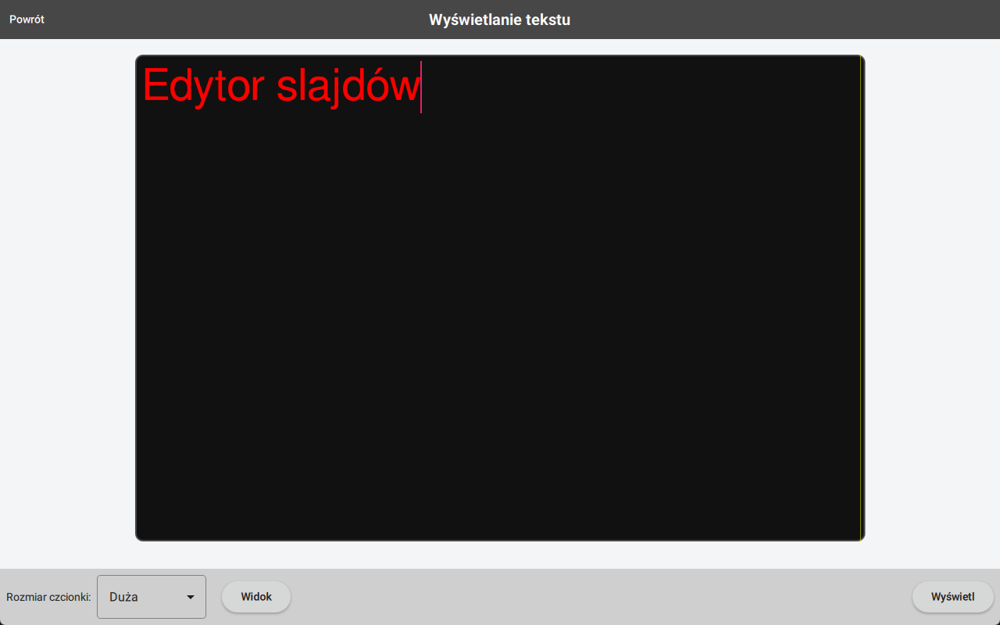
  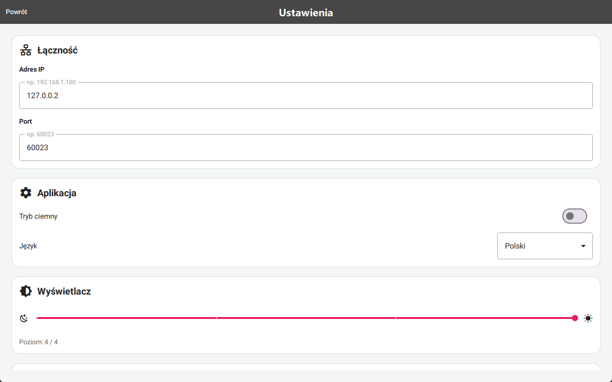
  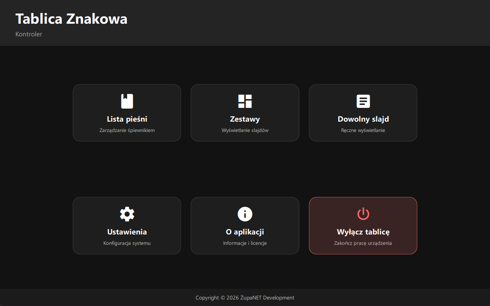
  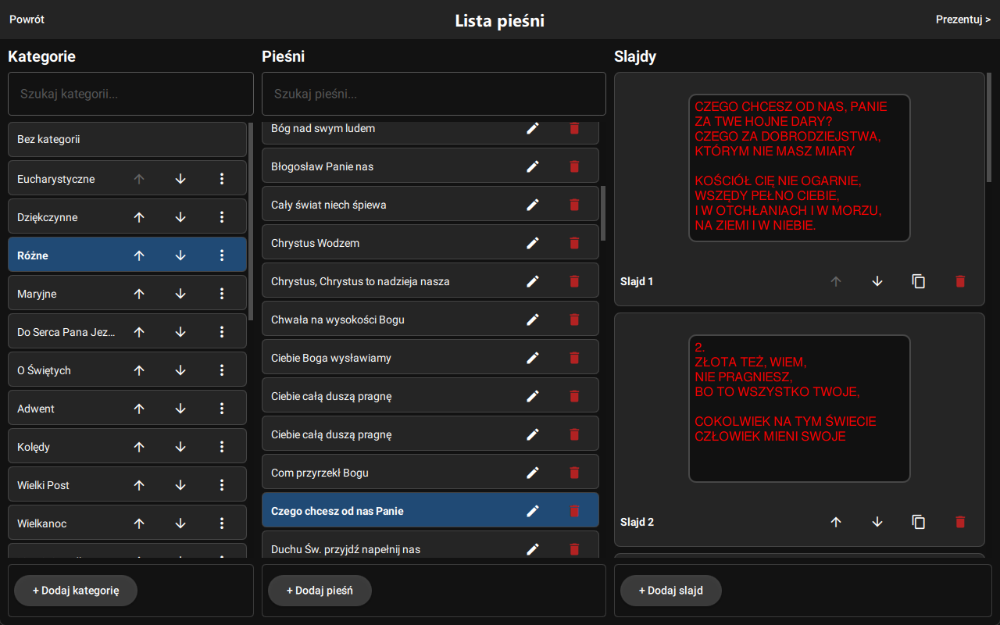
  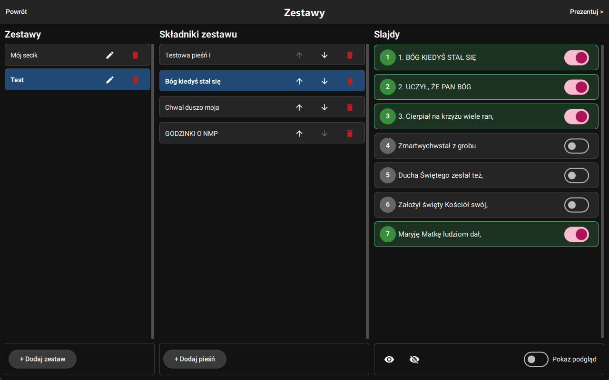
  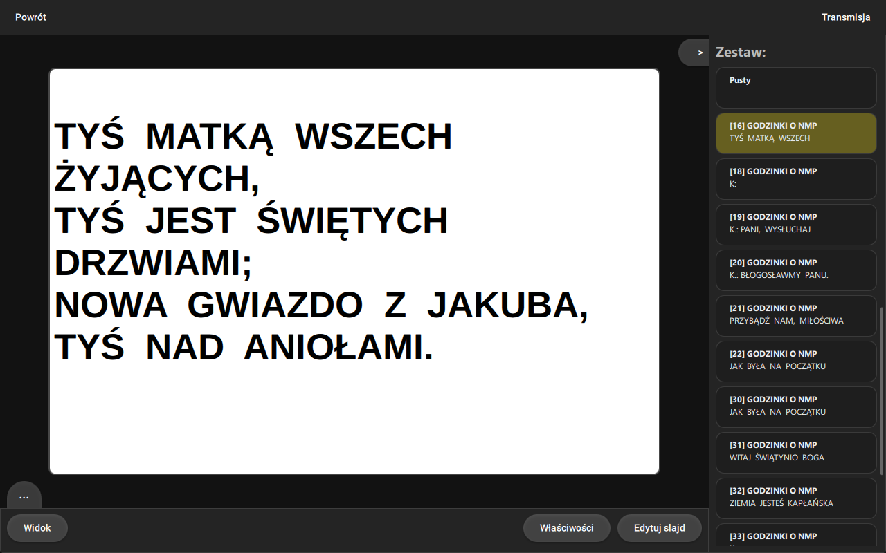
  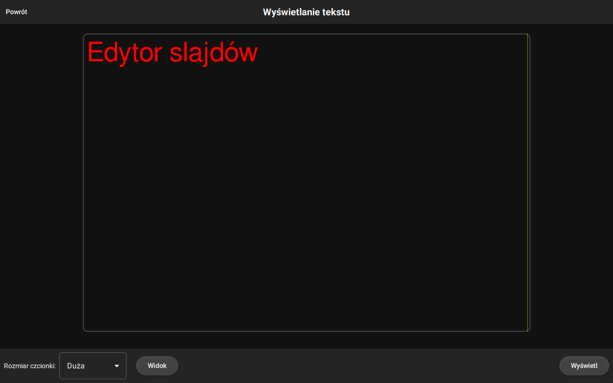
  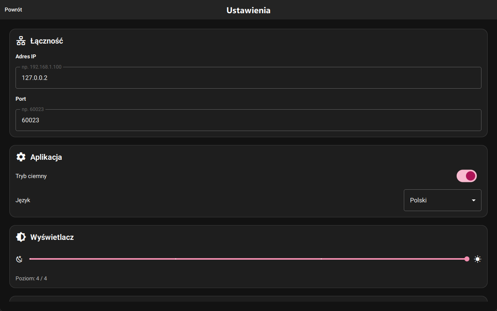

# Licencja

Copyright (C) 2026 ŻupaNET Development

This program is free software: you can redistribute it and/or modify
it under the terms of the GNU General Public License as published by
the Free Software Foundation version 2 of the License.

This program is distributed in the hope that it will be useful,
but WITHOUT ANY WARRANTY; without even the implied warranty of
MERCHANTABILITY or FITNESS FOR A PARTICULAR PURPOSE. See the
GNU General Public License for more details.

The above copyright notice, this permission notice, and its license shall be included in all copies or substantial portions of the Software.

You can find a copy of the GNU General Public License v2 [here](https://www.gnu.org/licenses/)

## Biblioteki i zasoby osób trzecich

Informacje o licencjach bibliotek i zasobów osób trzecich wykorzystanych w projekcie można odnaleźć w katalogu [resources/licenses/](resources/licenses/)