

<h1 align="center">Tablica Znakowa - Controller</h1>

Tablica Znakowa - Controller (ang. Sign Board) is alternative software that supports MKEiA's church LED displays.

  
  
  

   

 <a href="https://github.com/ZupaNET/tablica-znakowa-controller/releases">
   <image src="https://i.ibb.co/q0mdc4Z/get-it-on-github.png" height="80"/>
 </a>

## Overview

Sign Board - Controller is a simple, lightweight, and open-source manager for managing a database of church hymns and displaying them on LED sign boards formerly manufactured by MKEiA.

- Compatible with original MKEiA LED sign boards!
- Built-in fonts used on the actual hardware!
- Ability to categorize hymns and organize them into sets!
- Ability to hide individual slides depending on the set!
- Support for the most popular consumer platforms: Windows and Android!

The app is best used on a computer or tablet.

**Note!** “Tablica Znakowa - Controller is only a controller! It does not have a song projection function.
For full functionality, you need an original LED display from MKEiA (with support for the simplified MKEiA protocol) or the *Tablica Znakowa* emulator from ŻupaNET Development.

  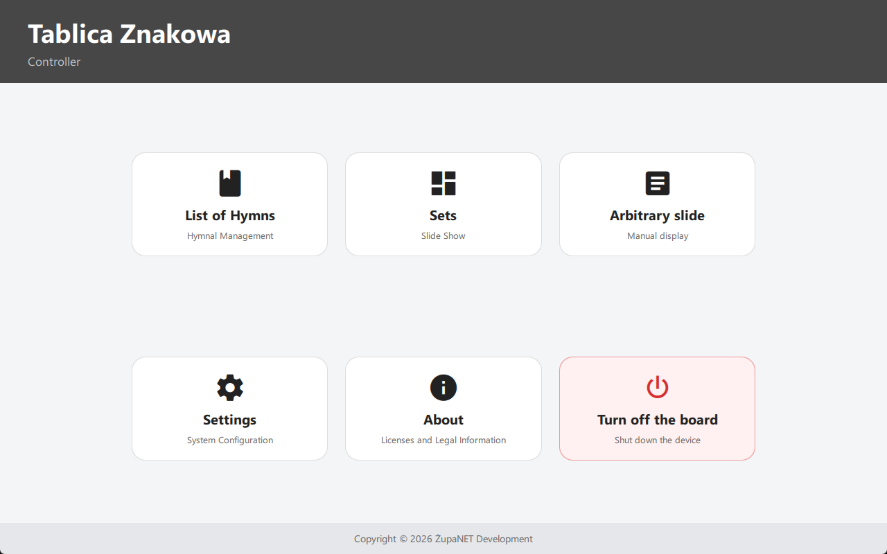
  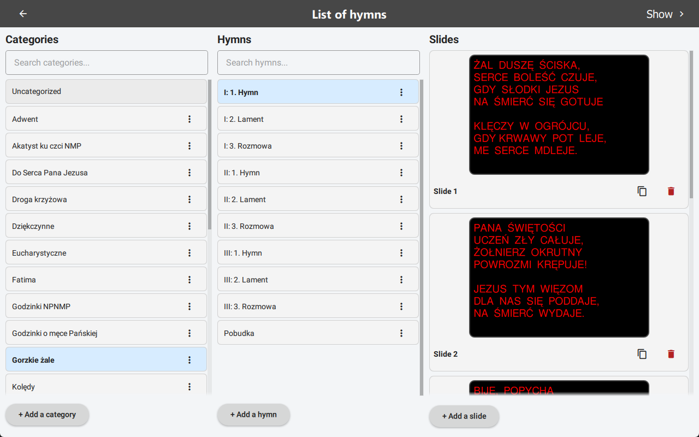
  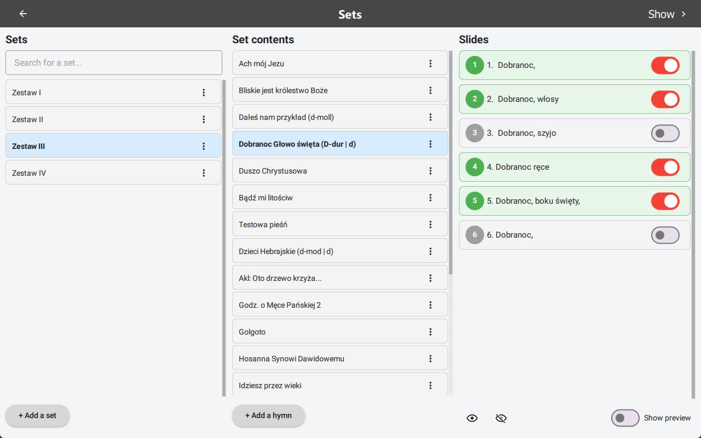
  
  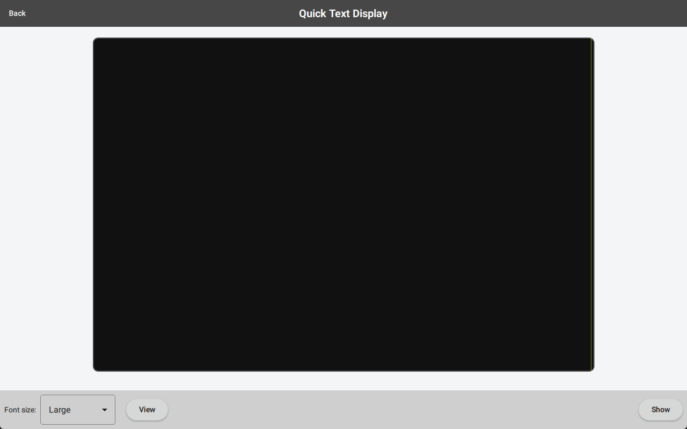
  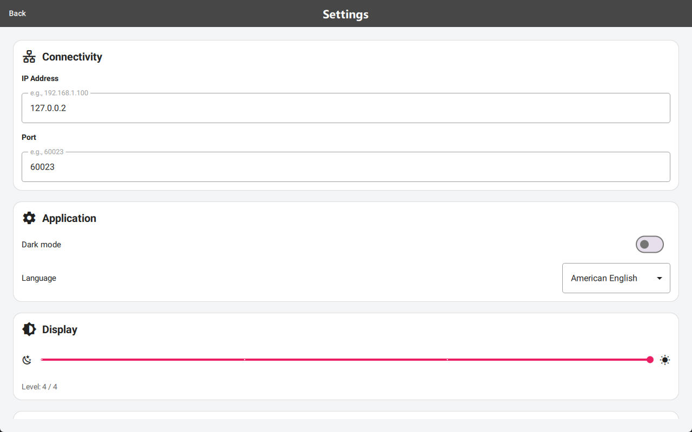
  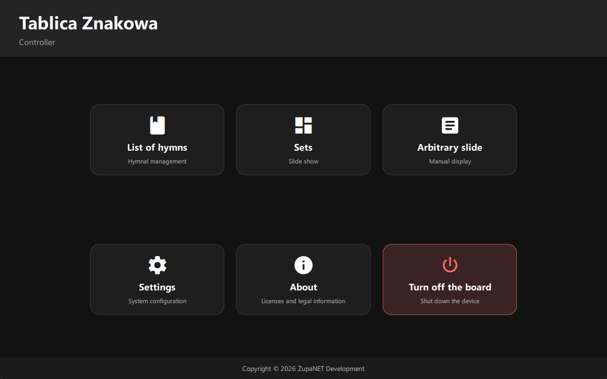
  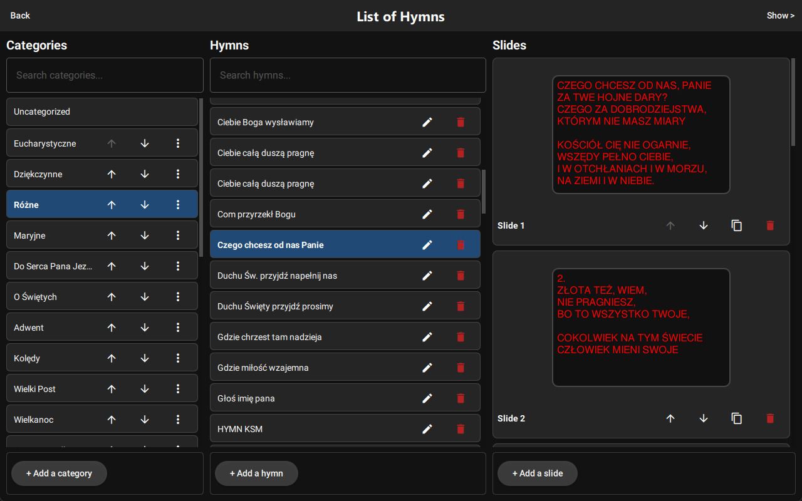
  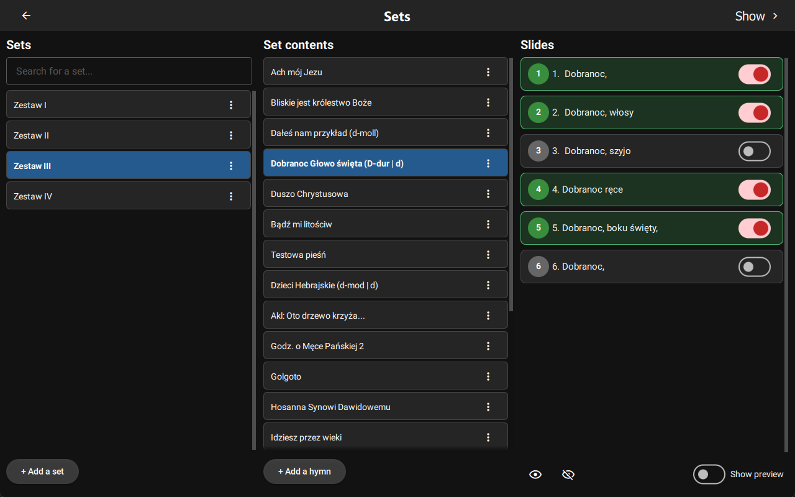
  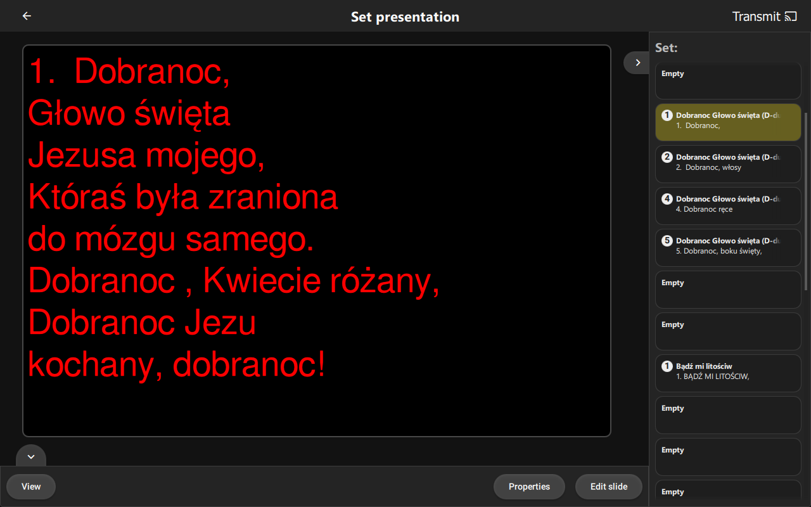
  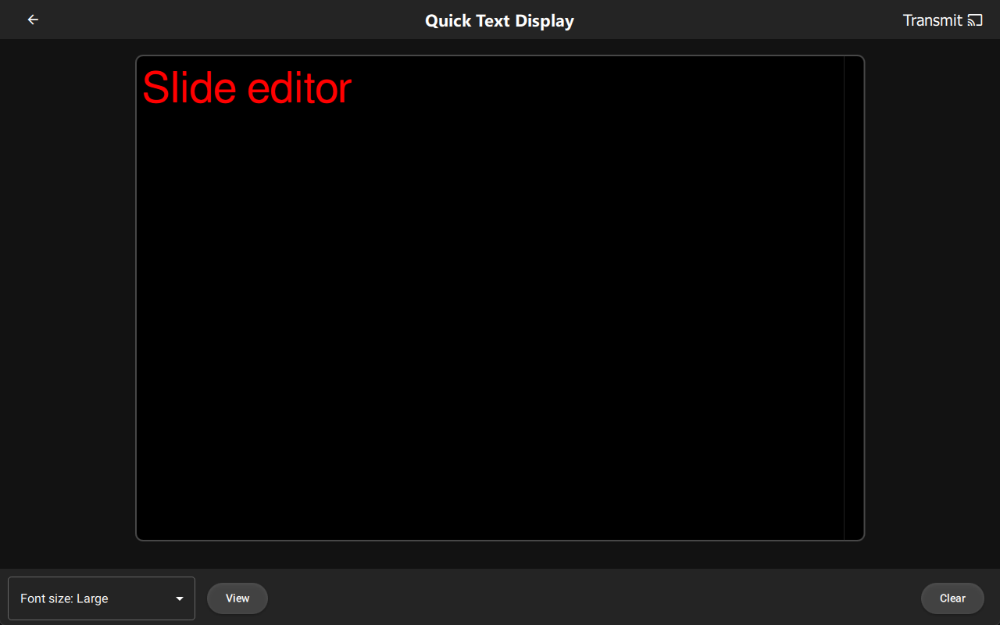
  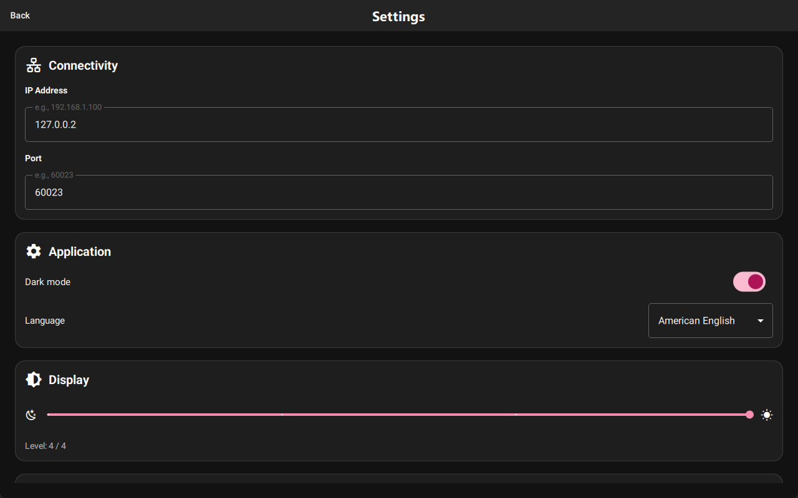

# Copyright

Copyright (C) 2026 ŻupaNET Development

This program is free software: you can redistribute it and/or modify
it under the terms of the GNU General Public License as published by
the Free Software Foundation version 2 of the License.

This program is distributed in the hope that it will be useful,
but WITHOUT ANY WARRANTY; without even the implied warranty of
MERCHANTABILITY or FITNESS FOR A PARTICULAR PURPOSE. See the
GNU General Public License for more details.

The above copyright notice, this permission notice, and its license shall be included in all copies or substantial portions of the Software.

You can find a copy of the GNU General Public License v2 [here](https://www.gnu.org/licenses/)

## Third-Party Libraries and Resources

Information about the licenses for third-party libraries and resources used in the project can be found in the [resources/licenses/](resources/licenses/) directory